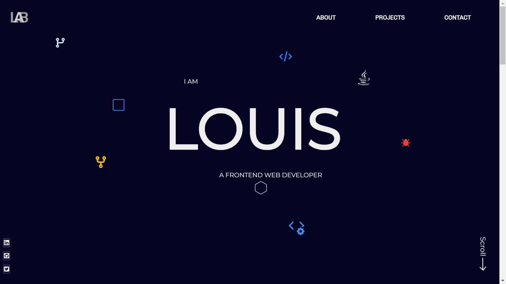

# Portfolio website v1


## Table of contents

- [Overview](#overview)
  - [The features](#the-features)
  - [Screenshot](#screenshot)
  - [Links](#links)
- [My process](#my-process)
  - [Built with](#built-with)
  - [What I learned](#what-i-learned)


## Overview

### The features

Users should be able to:

- View the optimal layout for the site depending on their device's screen size
- Discover a dynamic exposition of my diverse skillset.
- project showcase. My previous endeavors come to life through visually compelling imagery
- contact form and input validation.
-  With stringent input validation mechanisms in place
- Thank you for visiting my portfolio. I look forward to the opportunity of connecting and collaborating.

### Screenshot



### Links

- Solution URL: [solution](https://github.com/louis-bamidele/project6-PortfolioVersion1)
- Live Site URL: [live site](https://louis-bamidele.github.io/project6-PortfolioVersion1/)

## My process

### Built with

- HTML
- HTML5
- CSS
- SCSS
- javascript

### What I learned

i learned alot but my favourite function is the function i wrote to validate the user imput using regex and switch statement.

See code snippets, see below:

```javascript
 
 function handleInputChange(e) {
  let { value, name } = e;
  console.log(value, name);
  let regex = "";
  switch (name) {
    case "name":
      regex = /^[A-Za-z ]+$/;
      break;
    case "email":
      regex = /^[a-zA-Z0-9._%+-]+@[a-zA-Z0-9.-]+\.[a-zA-Z]{2,}$/;
      break;
    case "textarea":
      regex = /^(\S+\s+)+\S+$/;
      break;
    default:
      break;
  }
  let boolean = regex.test(value);
  console.log(boolean);
  console.log(value, name);
  if (boolean) {
    e.classList.remove("invalid-input");
  } else {
    e.classList.add("invalid-input");
  }
}
```
